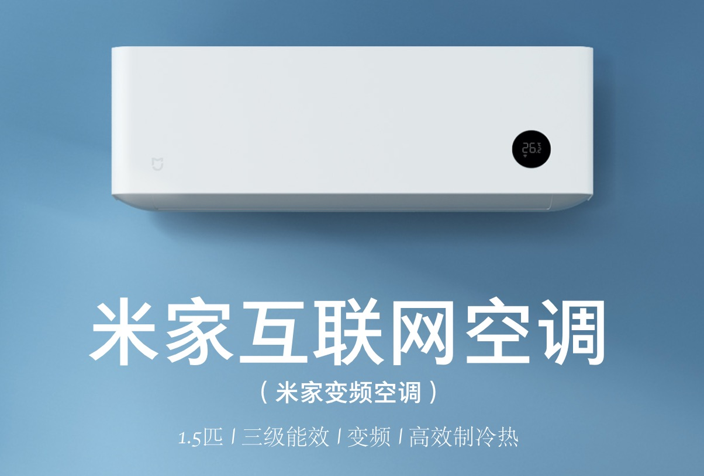

# Zhimi Air Conditioning MA1 Component

This is a custom component for home assistant to integrate the Zhimi(Xiaomi\ Mijia) Air Conditioning ( zhimi.aircondition.ma1 ):


only test:
| Model ID          | fw_ver | mcu_fw_ver                            | hw_ver    |
|-------------------|--------------|-----------------------------------------|----------|
| `zhimi.aircondition.ma1`    | 2.0.9     | 0010        | esp32   |

Please follow the instructions on [Retrieving the Access Token](https://www.home-assistant.io/components/vacuum.xiaomi_miio/#retrieving-the-access-token) to get the API token to use in the configuration.yaml file.

Credits: Thanks to [Rytilahti](https://github.com/rytilahti/python-miio) for all the work.

## Features

* Power (on, off)
* Target Temperature (min = 16, max = 32)
* Operation Mode (Heat, Cooling, Wind, Arefaction)
* Preset Mode (Sleep, Comfort, None)
* Fan Speed (Low, Low_medium, Medium, Medium_high, High, Auto)
* Swing Mode (Off, End_at_20, End_at_40, End_at_60)

* Attributes
  - ac_model
  - operation_mode
  - fan_speed
  - swing_mode
  - preset_mode
  - current_temperature
  - target_temperature
  - swing_angle
  - lcd_setting
  - volume
  - idle_timer
  - open_timer
  
  
## Install

You can install it manually by copying the custom_component folder to your Home Assistant configuration folder.


## Setup

```yaml
# configuration.yaml

climate:
  - platform: zhimi
    name: Master Bedroom Air Conditioning
    host: 192.168.23.71
    token: 7abccb4844876e12ec402d832f69784c
```


## Debugging

If the custom component doesn't work out of the box for your device please update your configuration to enable a higher log level:

```yaml
# configuration.yaml

logger:
  default: warn
  logs:
    custom_components.zhimi.climate: debug
    miio: debug
```

## Entity Services

#### Service `zhimi.turn_on_ac_volume`

Turn on Zhimi air conditioning volume.

| Service data attribute    | Optional | Description                                                          |
|---------------------------|----------|----------------------------------------------------------------------|
| `entity_id`               |       no | Name(s) of Zhimi AC to turn on volume.               |

#### Service `zhimi.turn_off_ac_volume`

Turn off Zhimi air conditioning volume.

| Service data attribute    | Optional | Description                                                          |
|---------------------------|----------|----------------------------------------------------------------------|
| `entity_id`               |       no | Name(s) of Zhimi AC to turn off volume.               |

#### Service `zhimi.set_ac_lcd_level`

Set Zhimi air conditioning lcd brightness level.

| Service data attribute    | Optional | Description                                                          |
|---------------------------|----------|----------------------------------------------------------------------|
| `entity_id`               |       no | Name(s) of Zhimi AC to set lcd level.               |
| `brightness`               |       no | 0 - 6, Zhimi AC LCD brightness level (0 = off, 6 = auto)               |

#### Service `zhimi.set_ac_swing_angle`

Set Zhimi air conditioning swing vertical angle.

| Service data attribute    | Optional | Description                                                          |
|---------------------------|----------|----------------------------------------------------------------------|
| `entity_id`               |       no | Name(s) of Zhimi AC to set swing vertical angle.               |
| `angle`               |       no | 0 - 6, Zhimi AC LCD brightness level (0 = off, 6 = auto)               |

#### Service `zhimi.set_ac_idle_timer`

Set Zhimi air conditioning idle timer.

| Service data attribute    | Optional | Description                                                          |
|---------------------------|----------|----------------------------------------------------------------------|
| `entity_id`               |       no | Name(s) of Zhimi AC to set idle timer.               |
| `timer`               |       no | 0 - 480, Zhimi AC idle timer (minutes, 0 = off)               |

#### Service `zhimi.set_ac_open_timer`

Set Zhimi air conditioning open timer.

| Service data attribute    | Optional | Description                                                          |
|---------------------------|----------|----------------------------------------------------------------------|
| `entity_id`               |       no | Name(s) of Zhimi AC to set open timer.               |
| `timer`               |       no | 0 - 480, Zhimi AC open timer (minutes, 0 = off)               |


