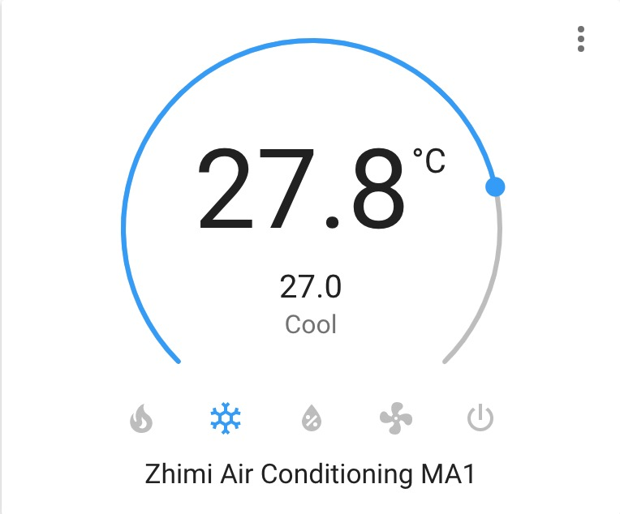

# 智米空调MA1组件 ([English](README.md))

This is a custom component for home assistant to integrate the Zhimi(Xiaomi\ Mijia) Air Conditioning ( zhimi.aircondition.ma1 ):


only test:
| Model ID          | fw_ver | mcu_fw_ver                            | hw_ver    |
|-------------------|--------------|-----------------------------------------|----------|
| `zhimi.aircondition.ma1`    | 2.0.9     | 0010        | esp32   |

Please follow the instructions on [Retrieving the Access Token](https://www.home-assistant.io/components/vacuum.xiaomi_miio/#retrieving-the-access-token) to get the API token to use in the configuration.yaml file.

## 功能

* 电源 (on, off)
* 设定温度 (调节精度：0.1°C, 最低：16°C, 最高：30°C)
* 空调模式 (加热, 制冷, 通风, 除湿)
* 预设模式 (睡眠, 舒适, 正常)
* 风速调整 (Low, Low_medium, Medium, Medium_high, High, Auto)
* 扫风模式 (Off, End_at_20, End_at_40, End_at_60)
* 属性
  - ac_model
  - operation_mode
  - fan_speed
  - swing_mode
  - preset_mode
  - current_temperature
  - target_temperature
  - swing_angle
  - lcd_setting
  - volume
  - idle_timer
  - open_timer
* 实体服务
  - 打开智米空调声音
  - 关闭智米空调声音
  - 设置智米空调显示屏亮度
  - 设置智米空调上下扫风角度
  - 设置智米空调定时关机计时器
  - 设备智米空调定时开机计时器


  
## Install

You can install it manually by copying the custom_component folder to your Home Assistant configuration folder.


## Setup

```yaml
# configuration.yaml

climate:
  - platform: zhimi
    name: Master Bedroom Air Conditioning
    host: 192.168.23.71
    token: 7abccb4844876e12ec402d832f69784c
```



## Debugging

If the custom component doesn't work out of the box for your device please update your configuration to enable a higher log level:

```yaml
# configuration.yaml

logger:
  default: warn
  logs:
    custom_components.zhimi.climate: debug
    miio: debug
```

## 实体服务

#### Service `zhimi.turn_on_ac_volume`

打开智米空调声音.

| Service data attribute    | Optional | Description                                                          |
|---------------------------|----------|----------------------------------------------------------------------|
| `entity_id`               |       no | Name(s) of Zhimi AC to turn on volume.               |

#### Service `zhimi.turn_off_ac_volume`

关闭智米空调声音.

| Service data attribute    | Optional | Description                                                          |
|---------------------------|----------|----------------------------------------------------------------------|
| `entity_id`               |       no | Name(s) of Zhimi AC to turn off volume.               |

#### Service `zhimi.set_ac_lcd_level`

设置智米空调显示屏亮度.

| Service data attribute    | Optional | Description                                                          |
|---------------------------|----------|----------------------------------------------------------------------|
| `entity_id`               |       no | Name(s) of Zhimi AC to set lcd level.               |
| `brightness`               |       no | 0 - 6, Zhimi AC LCD brightness level (0 = off, 6 = auto)               |

#### Service `zhimi.set_ac_swing_angle`

设置智米空调上下扫风角度.

| Service data attribute    | Optional | Description                                                          |
|---------------------------|----------|----------------------------------------------------------------------|
| `entity_id`               |       no | Name(s) of Zhimi AC to set swing vertical angle.               |
| `angle`               |       no | 0 - 6, Zhimi AC LCD brightness level (0 = off, 6 = auto)               |

#### Service `zhimi.set_ac_idle_timer`

设置智米空调定时关机计时器.

| Service data attribute    | Optional | Description                                                          |
|---------------------------|----------|----------------------------------------------------------------------|
| `entity_id`               |       no | Name(s) of Zhimi AC to set idle timer.               |
| `timer`               |       no | 0 - 480, Zhimi AC idle timer (minutes, 0 = off)               |

#### Service `zhimi.set_ac_open_timer`

设备智米空调定时开机计时器.

| Service data attribute    | Optional | Description                                                          |
|---------------------------|----------|----------------------------------------------------------------------|
| `entity_id`               |       no | Name(s) of Zhimi AC to set open timer.               |
| `timer`               |       no | 0 - 480, Zhimi AC open timer (minutes, 0 = off)               |

## Credits

* [Rytilahti](https://github.com/rytilahti/python-miio)
* [syssi](https://github.com/syssi/xiaomi_airconditioningcompanion)

